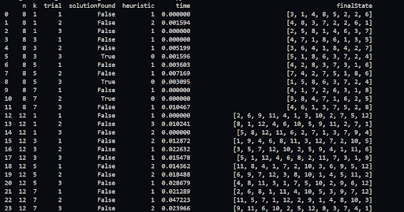
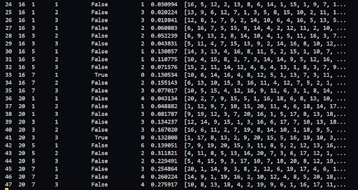
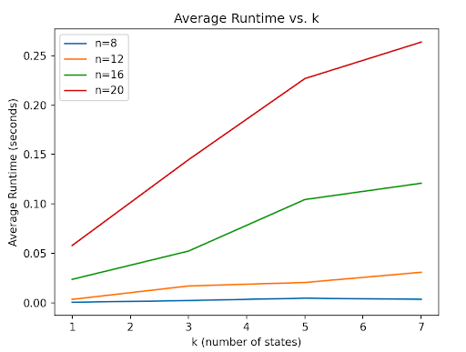

# N-Queens Problem Solver using Local Beam Search

This project implements a solution to the N-Queens problem using the **Local Beam Search** algorithm. The program explores heuristic-based methods to find non-attacking arrangements of queens on an `n x n` chessboard. It also includes an experimental analysis of the algorithm's performance under various configurations.

---

## Table of Contents
- [N-Queens Problem Solver using Local Beam Search](#n-queens-problem-solver-using-local-beam-search)
  - [Table of Contents](#table-of-contents)
  - [Features](#features)
  - [Technologies Used](#technologies-used)
  - [How It Works](#how-it-works)
  - [Usage Instructions](#usage-instructions)
  - [Experiment Analysis](#experiment-analysis)
  - [Results](#results)
    - [Success Rate vs. Beam Width (`k`)](#success-rate-vs-beam-width-k)
    - [Runtime Analysis](#runtime-analysis)
  - [Future Enhancements](#future-enhancements)
  - [Acknowledgments](#acknowledgments)

---

## Features
- Implements the **Local Beam Search** algorithm.
- Generates random initial states for the algorithm.
- Tracks the best solutions across iterations to improve performance.
- Calculates heuristic values to evaluate states (number of attacking queen pairs).
- Analyzes the algorithm's performance:
  - Success rates.
  - Average runtime vs the number of states `k`.
- Visualizes results using matplotlib for clear interpretation.

---

## Technologies Used
- **Python 3.9+**
- **pandas**: For data analysis and manipulation.
- **matplotlib**: For visualizing runtime and success rates.
- **random** and **time**: For randomness and performance measurement.

---

## How It Works
1. **Initial States**: The algorithm begins by generating `k` random board states.
2. **Heuristic Evaluation**: Each state is scored based on the number of conflicting queens.
3. **Successor Generation**: For each state, all possible successor states are generated by moving queens within their columns.
4. **State Selection**: The algorithm keeps the `k` best states from the successors for the next iteration.
5. **Solution Checking**: If a state with `heuristic == 0` is found, it is returned as the solution.
6. **Termination**: The algorithm stops if no improvement is observed, returning the best state found.

---

## Usage Instructions
1. **Install Dependencies**: Make sure the following Python libraries are installed:
   ```bash
   pip install pandas matplotlib
    ```
2. **Run the Program**: Execute the Python script to find solutions and analyze the algorithm's performance.

3. **Custom Parameters**: Modify the runExperiments() function to test different board sizes (`n`) and beam widths (`k`).

---

## Experiment Analysis

The project includes experiments that test the algorithm under various configurations:

- **n**: Board sizes tested (e.g., 8, 12, 16, 20).
- **k**: Number of states tracked in the beam (e.g., 1, 3, 5, 7).
- **Trials**: Repeated trials for statistical accuracy.

For each experiment, the algorithm records:
- Whether a solution was found.
- The heuristic value of the best state.
- The runtime in seconds.

The results are saved and visualized to better understand the algorithm's performance across different scenarios.

---

## Results

### Success Rate vs. Beam Width (`k`)
The experiments demonstrate that varying the value of `k` impacts the program’s ability to find solutions:

- **Smaller `n` Values**: Increasing `k` improves the success rate as it allows the algorithm to explore multiple promising states. This reduces the likelihood of getting stuck in a local minimum.
- **Larger `n` Values**: The benefits of increasing `k` diminish because the state space grows exponentially. Tracking more states cannot effectively cover this vast search space.

For example, the provided figure illustrates how increasing `k` significantly impacts smaller values of `n`, but has minimal effect for larger values of `n`. Larger `k` values are beneficial for small to medium problem sizes, but the benefits decrease for larger problem sizes due to the inherent complexity of the n-Queens problem.




### Runtime Analysis

The experiments reveal that for a fixed value of `k`, the runtime increases as `n` increases:

- **Smaller `n` Values**: The runtime is manageable because the state space is relatively small, and fewer conflicts need to be evaluated.
- **Larger `n` Values**: The runtime increases significantly due to:
  - The larger state space.
  - A higher number of conflicts to evaluate.
  - More iterations required to either find a solution or determine that no progress can be made.

For very large values of `n`, local beam search becomes impractical:
- The state space grows exponentially, making it impossible for the algorithm to explore a sufficient portion, even with larger values of `k`.
- The heuristic loses its effectiveness in guiding the search through such a vast space.
- The computational cost of generating and sorting successors becomes excessive.

While local beam search is suitable for small to medium `n` values, it is not practical for very large problem sizes due to both heuristic limitations and computational resource requirements. The provided figure illustrates how the runtime increases as `n` grows, even with a fixed value of `k`.



---

## Future Enhancements

- Implement additional search algorithms (e.g., Genetic Algorithm, Simulated Annealing) for comparison.
- Optimize the successor generation process for larger board sizes to reduce runtime.
- Parallelize the evaluation of successor states for improved performance on multi-core systems.
- Add a graphical interface to dynamically visualize the placement of queens on the chessboard.

---

## Acknowledgments

This project is inspired by classic AI search problems and serves as a demonstration of heuristic search techniques for solving combinatorial optimization problems.

---
